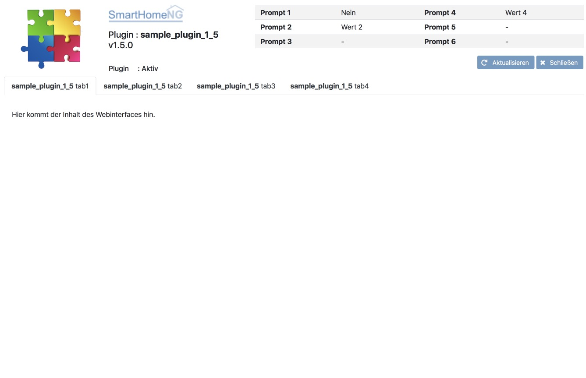

.. index:: New; Web Interface

.. role:: redsup
.. role:: bluesup

Web Interface :bluesup:`update`
===============================

This documentation is valid vor SmartHomeNG versions beyond v1.4.2. It does not work on v1.4.2
and below.

Extending an existing plugin
----------------------------

For extending an existing smart-plugin with a webinterface, the following steps have to be followed:

   1. Add the webif directory from the sample plugin to the plugin's directory
   2. Change the import statement for **lib.smartplugin** from
      ``from lib.model.smartplugin import SmartPlugin`` to
      ``from lib.model.smartplugin import *``
   3. Add the following statement to the ``__init__`` method of the plugin: ``self.init_webinterface()``
   4. Ad the method ``init_webinterface`` to the plugin's class (copy from sample_plugin)
   5. Add the ``WebInterface`` class after the end of the plugin's class definition. Copy it from the sample plugin.

Now the plugin has a functional but empty webinterface:

Filling the webinterface with content
-------------------------------------

To bring the webinterface up to life, the following steps should be followed:

   1. Modify the method ``index`` of the class ``WebInterface`` to hand over the needed data
      (here a list of items that have the attribute knx_dpt) to the template engine.
      Modify the sample code from:

      .. code-block:: PYTHON

         @cherrypy.expose
         def index(self, reload=None):
             """
             Build index.html for cherrypy

             Render the template and return the html file to be delivered to the browser

             :return: contents of the template after beeing rendered
             """
             # add values to be passed to the Jinja2 template eg: tmpl.render(p=self.plugin, interface=interface, ...)
             tmpl = self.tplenv.get_template('index.html')
             return tmpl.render(p=self.plugin)

      to:

      .. code-block:: PYTHON

              @cherrypy.expose
              def index(self, reload=None):
                  """
                  Build index.html for cherrypy

                  Render the template and return the html file to be delivered to the browser

                  :return: contents of the template after beeing rendered
                  """
                  tmpl = self.tplenv.get_template('index.html')
                  # add values to be passed to the Jinja2 template eg: tmpl.render(p=self.plugin, interface=interface, ...)
                  return tmpl.render(p=self.plugin)

                  # get list of items with the attribute knx_dpt
                  plgitems = []
                  for item in self.items.return_items():
                      if 'knx_dpt' in item.conf:
                          plgitems.append(item)

                  # additionally hand over the list of items, sorted by item-path
                  tmpl = self.tplenv.get_template('index.html')
                  return tmpl.render(p=self.plugin,
                                     items=sorted(plgitems, key=lambda k: str.lower(k['_path'])),
                                    )

   2. Modify the template **webif/templates/index.html** to display the data you want.
      To display a list of the items selected by the Python code above on the first tab of the
      body of the webinterface, insert the following code between ```` and
      ````:

      .. code-block:: HTML

         

             

                 <table class="table table-striped table-hover pluginList">
                     <thead>
                         <tr>
                             <th>{{ _('Item') }}</th>
                             <th>{{ _('Typ') }}</th>
                             <th>{{ _('knx_dpt') }}</th>
                         </tr>
                     </thead>
                     <tbody>
                         
                             <tr>
                                 <td class="py-1">{{ item._path }}</td>
                                 <td class="py-1">{{ item._type }}</td>
                                 <td class="py-1">{{ item.conf['knx_dpt'] }}</td>
                             </tr>
                         
                     </tbody>
                 </table>
             

         

   3. The logo on the topleft is automatically replaced with the logo of the **plugin type**.
      If the webinterface should have an individaul logo, the file with the logo must be placed in
      the directory **webif/static/img** and has to be named **plugin_logo**. It may be of type **.png**, **.jpg** or **.svg**.

3rd Party Components for Web Interfaces
---------------------------------------

SmartHomeNG delivers a couple of 3rd party components with the http module, which can be used to build extended, more
complex web interfaces:

   * JQuery 3.4.1:

     * JS: 
   * Bootstrap :

     * CSS: <link rel="stylesheet" href="/gstatic/bootstrap/css/bootstrap.min.css" type="text/css"/>
     * JS: 
   * Bootstrap Tree View:

      * CSS: <link rel="stylesheet" href="/gstatic/bootstrap-treeview/bootstrap-treeview.css" type="text/css"/>
      * JS: 
   * Bootstrap Datepicker v1.8.0:

      * CSS: <link rel="stylesheet" href="/gstatic/bootstrap-datepicker/dist/css/bootstrap-datepicker.min.css" type="text/css"/>
      * JS:
         * 
         * 
   * popper.js:

      * JS: 
   * CodeMirror 5.46.0:

      * CSS: <link rel="stylesheet" href="/gstatic/codemirror/lib/codemirror.css"/>
      * JS: 
   * Font Awesome 5.8.1:

      * CSS: <link rel="stylesheet" href="/gstatic/fontawesome/css/all.css" type="text/css"/>

 For addons, etc. that are delivered with the components, see /modules/http/webif/gstatic folder!

 If you are interested in additional "global" components, contact us. Otherwise feel free to use them in your plugin,
 as long as the Open Source license is ok.
