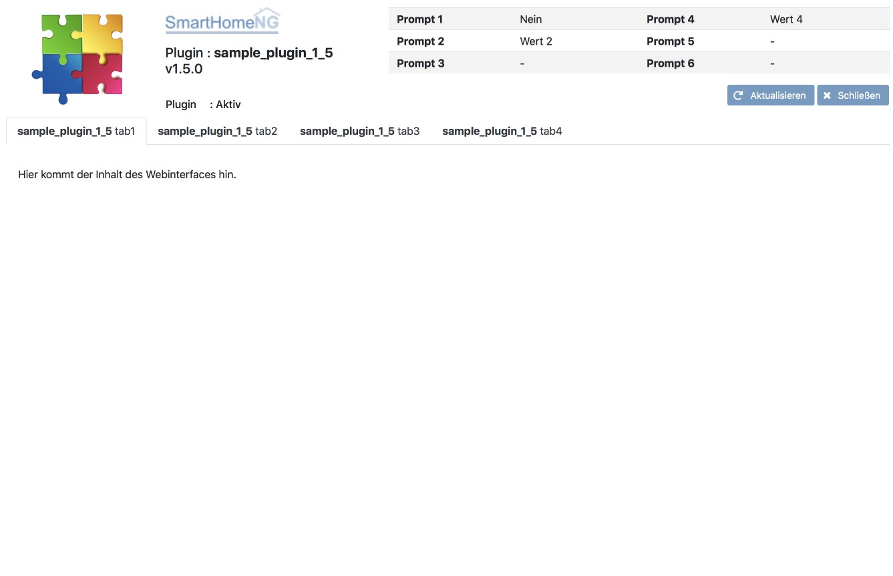

.. index:: Web Interface

.. role:: redsup
.. role:: bluesup

Extending an existing plugin
----------------------------

For extending an existing smart-plugin with a webinterface, the following steps have to be followed:

   1. Add the webif directory from the sample plugin to the plugin's directory
   2. Change the import statement for **lib.smartplugin** from
      ``from lib.model.smartplugin import SmartPlugin`` to
      ``from lib.model.smartplugin import *``
   3. Add the following statement to the ``__init__`` method of the plugin: ``self.init_webinterface()``
   4. Ad the method ``init_webinterface`` to the plugin's class (copy from sample_plugin)
   5. Add the ``WebInterface`` class after the end of the plugin's class definition. Copy it from the sample plugin.

Now the plugin has a functional but empty webinterface:

The Method **index** of the class WebInterface implements the page of the web interface. It renders the template and
makes all data of the plugin public to the render engine (``return tmpl.render(p=self.plugin)``) as ``p``. If further
data is needed, it has to be added to **tmpl.render()**.

Now the only thing left to do, is adding the data that shall be displayed to the template file (webif/templates/index.html).

Details kan be found in the following section (**Filling the webinterface with content**)
