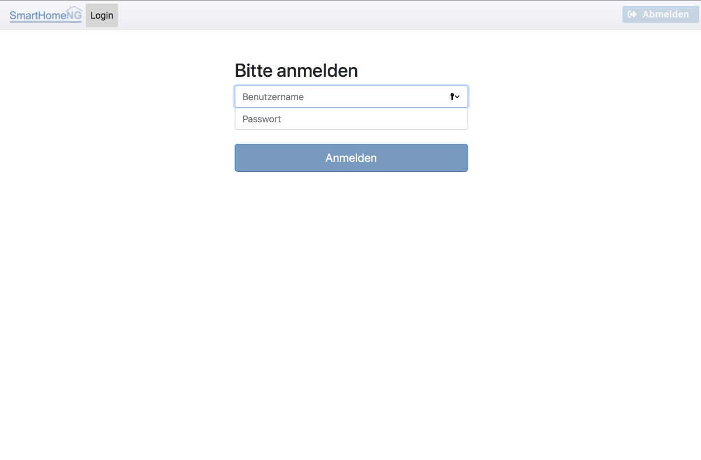

.. index:: Administrations GUI
.. index:: Administrations-Interface
.. index:: Webinterfaces; Administrations GUI
.. index:: Webinterfaces; Administrations-Interface

.. role:: bluesup
.. role:: redsup


Administrations-Interface :bluesup:`Update`
===========================================

Seit SmartHomeNG v1.2 steht eine graphische Oberfläche zur Verfügung, die bei der Administration
von SmartHomeNG hilft. Dazu implementiert SmartHomeNG einen eigenen Webserver, der in der Standardkonfiguration
auf **Port 8383** hört.

Diese Oberfläche wurde bisher durch das **Backend Plugin** zur Verfügung gestellt. Das Backend Plugin ist unter
:doc:`/plugins/backend/user_doc` ausführlich beschrieben. Es wird jedoch in einer der kommenden Versionen entfernt,
da seit v1.6 ein neues graphisches Administrations-Interface zur Verfügung steht, welches eine Weiterentwicklung des
Backend Plugins ist und in der Funktionalität über die Möglichkeiten des Backend Plugins hinausgeht.

Während das Backend Plugin vorwiegend zur Anzeige von Informationen über die SmartHomeNG Installation diente, ermöglicht
das Admin-Interface nach die vollständige Konfiguration von SmartHomeNG.

Um einen problemlosen Übergang zu gewährleisten, steht das Backend Plugin für einen Übergangszeit weiter zur Verfügung.
Es ist als deprecated (veraltet) eingestuft und wird voraussichtlich mit v1.8 von SmartHomeNG entfernt.


Das Administrations-Interface wird durch folgenden Aufruf gestartet:

.. code::

   http://<ip Ihres SmartHomeNG-Servers>:8383/admin


Über die Systemkonfiguration kann eingestellt werden, dass ```http://<ip Ihres SmartHomeNG-Servers>:8383```
statt wie bisher auf das Backend Plugin, auf das Administrations-Interface verweist


Falls in der Konfiguration für das http Modul eine User/Passwort Kombination konfiguriert wurde, wird diese benötigt um
auf das Admin-Interface zuzugreifen:





Ansonsten wird direkt die Übersichtsseite der Systemeigenschaften angezeigt.

Wenn eine Anmeldung notwendig ist, so ist dieses nicht auf die Session beschränkt. Ein Beenden des Browsers meldet den
Anwender nicht ab. Hierzu muss der Abmelde-Button in der Navigation genutzt werden. Eine automatische Abmeldung erfolgt
nur, wenn das im Browser gespeicherte Token abläuft. Die Lebensdauer des Token ist in der Systemkonfiguration im Tab
**Admin Modul** konfigurierbar.


.. toctree::
   :maxdepth: 4
   :hidden:
   :titlesonly:

   systemeigenschaften
   dienste
   items
   logiken
   scheduler
   plugins
   scenes
   threads
   logs


