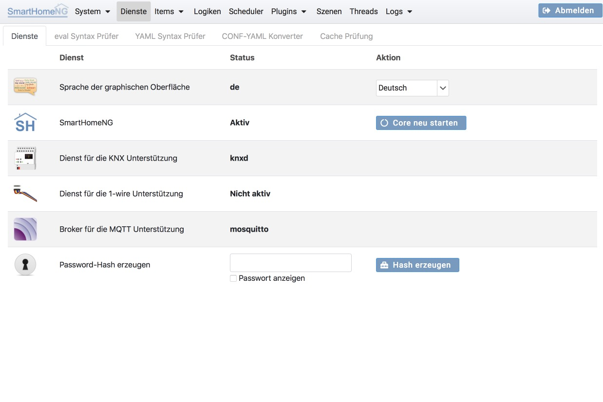
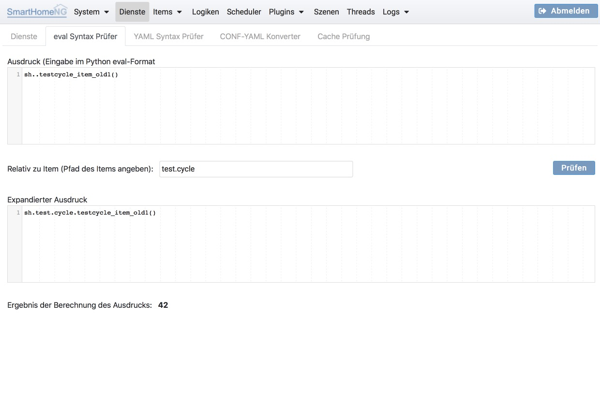
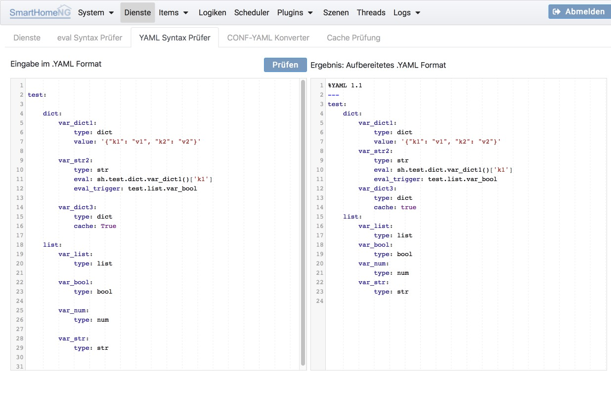
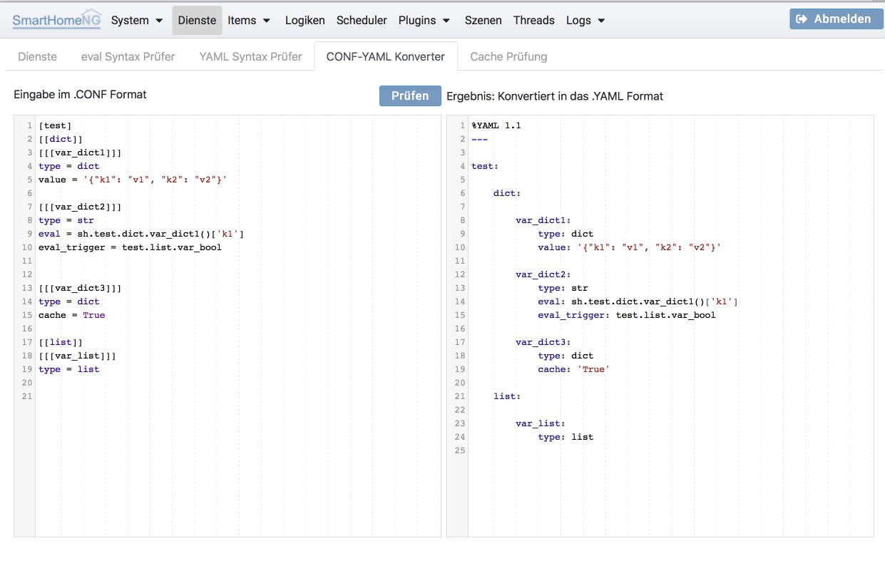
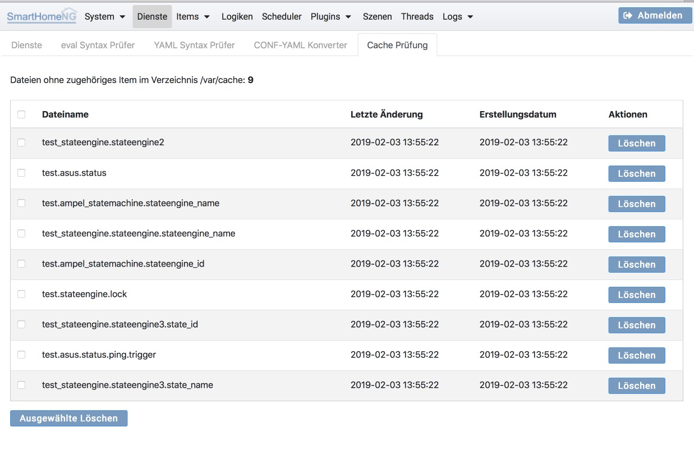

.. index:: Dienste

=======
Dienste
=======

Auf dem Dienste Tab kann temporär die Sprache von SmartHomeNG umgeschaltet werden. Außerdem ist es möglich SmartHomeNG neu
zu starten und Password-Hashes zu erzeugen (z.B. für das CLI Plugin).

Weiterhin kann der Status einiger von Plugins genutzter Dienste angesehen werden, soweit diese Dienste auf dem selben
Rechner laufen wie SmartHomeNG selbst.

.. index:: eval Syntax-Prüfer
.. index:: Dienste; eval Syntax-Prüfer
.. index:: Backup
.. index:: Dienste; Backup
.. index:: Sicherung der Konfiguration

Dienste
=======

Auf diesem Tab können folgende Funktionen ausgelöst werden:

* Neu starten des Core von SmartHomeNG

  Diese Funktion setzt voraus, dass SmartHomeNG läuft

* Herunterladen der Konfigurationsdaten von SmartHomeNG als Zip Archiv

  Das Zip-Archiv enthält die yaml Konfigurationsdateien aus dem /etc Verzeichnis (logging.yaml, logic.yaml,
  module.yaml, plugin.yaml, smarthome.yaml und struct.yaml). Weiterhin sind alle yaml Dateien der Verzeichnisse
  /items und /scenes enthalten. Außerdem enthält das Archiv den Python Code der Logiken aus dem Verzeichnis /logics.

  Das heruntergeladene Archiv trägt den Namen shng_config_backup_<Jahr>-<Monat>-<Tag>.zip

In den folgenden Zeilen wird der Status diverser Dienste angezeigt, die optional benötigt werden (abhängig von den
eingesetzten Plugins).

Außerdem ist es möglich zu einem Passwort einen Hash Wert zu erzeugen, um diesen in der Konfiguration von Plugins zu
speichern. Für die Passworte, die vom Core bzw. den Modulen verwendet werden ist das nicht notwendig, da hier der
Hash bei der Konfiguration automatisch erzeugt wird.

eval Syntax-Prüfer
==================

Auf diesem Tab können eval Ausdrücke auf richtigen Syntax geprüft werden. Die Evaluierung der Ausdrücke findet im Kontext
von SmartHomeNG statt, so dass auf alle Items und Funktionen von Plugins zugegriffen werden kann. Es ist auch möglich
relative Item Referenzen anzugeben. Damit die relativen Referenzen richtig aufgelöst werden, muss in einem separaten Feld
das Item (als Item-Pfad) angegeben werden, zu welchem die Referenzen relativ sind.

Angezeigt wird als Ergebnis der expandierte Ausdruck, bei dem alle relativen Referenzen aufgelöst sind und als absolute
Referenzen angezeigt werden. Im expandierten Ausdruck kann dadurch geprüft werden, ob die relativen Referenzen richtig
angegeben wurden.

Weiterhin wird der resultierende Wert des Ausdrucks und der Datentyp des Resultats angezeigt.

.. index:: YAML Syntax-Prüfer
.. index:: Dienste; YAML Syntax-Prüfer

YAML Syntax-Prüfer
==================

Im YAML Syntax-Prüfer kann ein Textausschnitt im YAML Format eingegeben und überprüft werden. Als Ergebnis wird der durch einen
YAML Interpreter interpretierte und aufbereitete Ausdruck angezeigt.

.. index:: CONF-YAML Konverter
.. index:: Dienste; CONF-YAML Konverter

CONF-YAML Konverter
===================

Der CONF-YAML Konverter dient dazu, Sippets die im alten CONF Format vorliegen in das YAML Format zu konvertieren.

.. index:: Cache Prüfung
.. index:: Dienste; Cache Prüfung

Cache Prüfung
=============

Auf diesem Tab kann der SmartHomeNG Item-Cache überprüft werden. Dazu werden alle im Directory ../var/cache vorhandenen
Dateien angezeigt, zu denen es kein Item gibt oder zu denen es zwar ein Item gibt, bei dem jedoch das cache Attribut
nicht gesetzt ist.

Gelöscht werden können entweder einzelne Cache Dateien durch den **Löschen** Button in der jeweiligen Zeile, oder die
zu löschenden Cache Dateien können mit Hilfe der Checkbox in der jeweiligen Zeile markiert werden und anschließend mit
dem Button **Ausgewählte Löschen** gelöscht werden.

