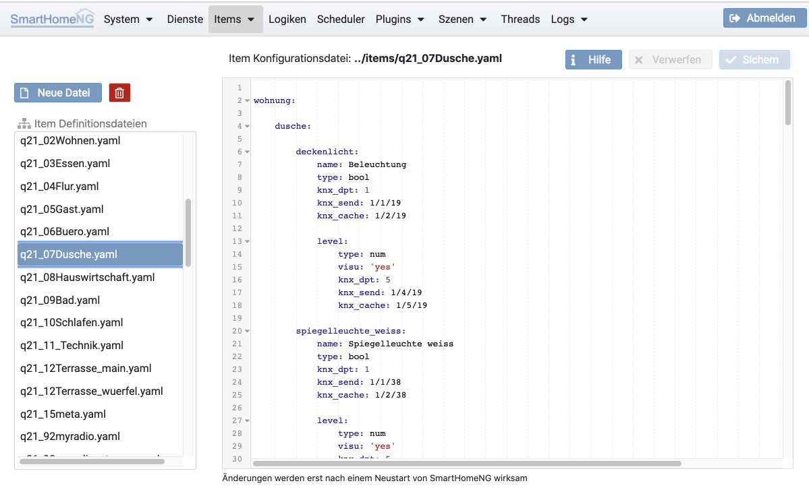

==================
Item Konfiguration
==================

Hier können Dateien zur Definition von Items bearbeitet werden. Auf der linken Seite können Item-Konfigurationsdateien
angelegt, gelöscht oder zur Bearbeitung ausgewählt werden.

Eine Dialog-gestützte Konfiguration von Items (analog zur Plugin Konfiguration) wird in einem kommenden Release von
SmartHomeNG hinzu kommen.
