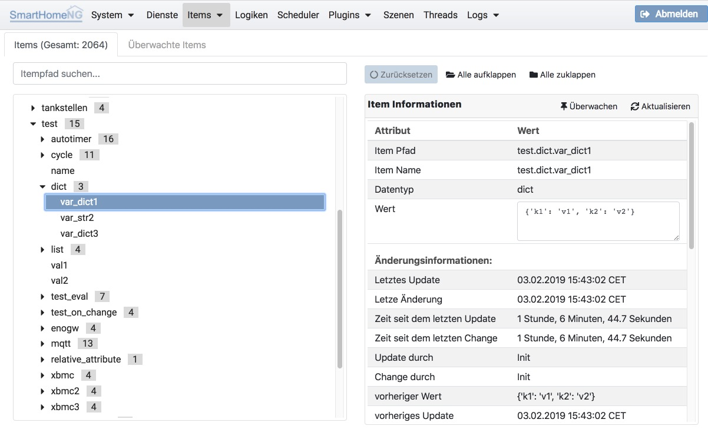

.. index:: Items

=====
Items
=====

Unter **Items** können die in SmartHomeNG Eigenschaften der eingelesenen Items angezeigt werden. Außerdem können die zur
Verfügung stehenden Itemstruktur-Templates angezeigt werden.

.. index:: Itemtree
.. index:: Items; Itemtree
.. index:: Items; Item Baum

Item Baum
=========

Hier kann die Baum-Struktur der geladenen Items angezeigt werden. Außerdem können die Eigenschaften und Attribute eines
ausgewählten Items angezeigt werden.

Der Item Baum kann die Items mit dem vollen Pfad-Namen oder verkürzt nur mit dem Item Namen (wie im Screenshot oben)
anzeigen. Das gewünschte Verhalten kann unter System/Konfiguration im Tab Admin Modul eingestellt werden. Dort kann
auch eingestellt werden, ab wieviel eingegebenen Zeichen die Suche beginnen soll.

In den rechts angezeigten Item Informationen kann der Wert des Items live angepasst werden.

.. toctree::
   :maxdepth: 4
   :hidden:
   :titlesonly:

   itemconfig
   itemstructs

