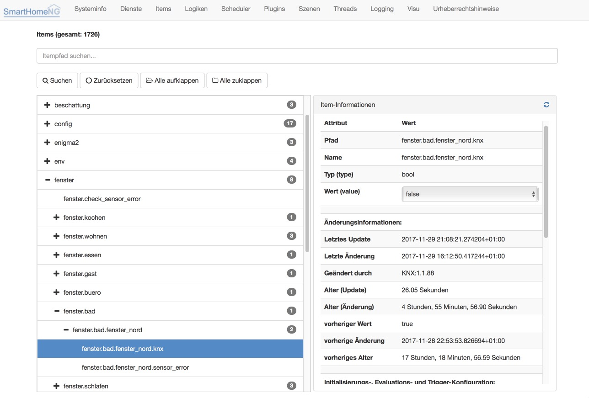

.. index:: Administrations GUI; Items

#####
Items
#####

.. note::

   Ist bisher im Admin Interface nicht implementiert. Bis auf weiteres bitte die Funktionalität
   im Backend Plugin nutzen.

Items im Backend Plugin
=======================

In der graphischen Oberfläche steht eine Übersicht über alle definierten Items zur Verfügung.

.. index:: Item Tree

Item Tree
=========

Der Item Tree ermöglicht die Ansicht der Attribute aller Items. Außerdem ist es möglich den
Wert des jeweiligen Items zu setzen.

