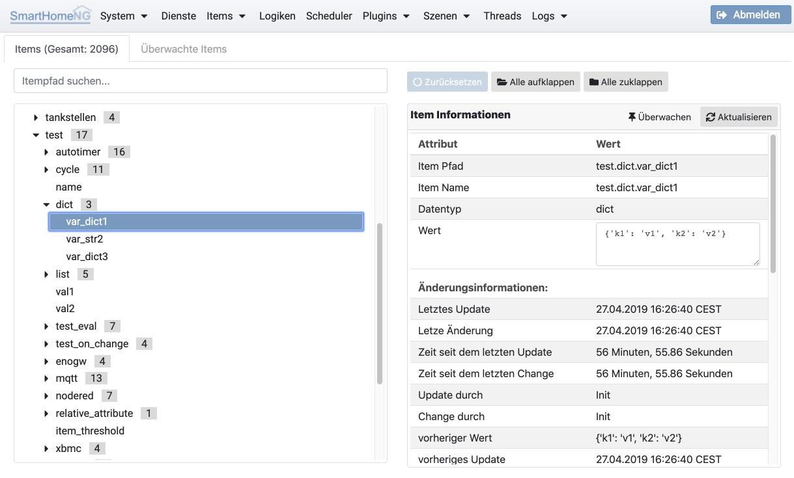

.. index:: Items

=====
Items
=====

Unter **Items** können die in SmartHomeNG Eigenschaften der eingelesenen Items angezeigt werden. Außerdem können die zur
Verfügung stehenden Itemstruktur-Teplates angezeigt werden.

.. index:: Itemtree
.. index:: Items; Itemtree
.. index:: Items; Item Baum

Item Baum
=========

Hier kann die Baum-Struktur der geladenen Items angezeigt werden. Außerdem können die Eigenschaften und Attribute eines
ausgewählten Items angezeigt werden.

In den rechts angezeigten Item Informationen kann der Wet des Items live angepasst werden.

.. index:: Struktur Templates
.. index:: Items; Struktur Templates

Struktur Templates
==================

Hier werden alle zur Verfügung stehenden Struktur Templates angezeigt. Das sind die Struktur Templates die von Plugins
definiert werden, die aktuell in SmartHomeNG konfiguriert sind und die in ../etc/structs.yaml konfigurierten Strukturen.
Strukturen aus Plugins sind daran zu erkennen, dass der Name der Item Struktur mit dem Namen des Plugins beginnt, an den
sich mit einem Punkt getrennt der eigentliche Name der Struktur anschließt.

.. image:: assets/items-structtemplates.jpg
   :class: screenshot

