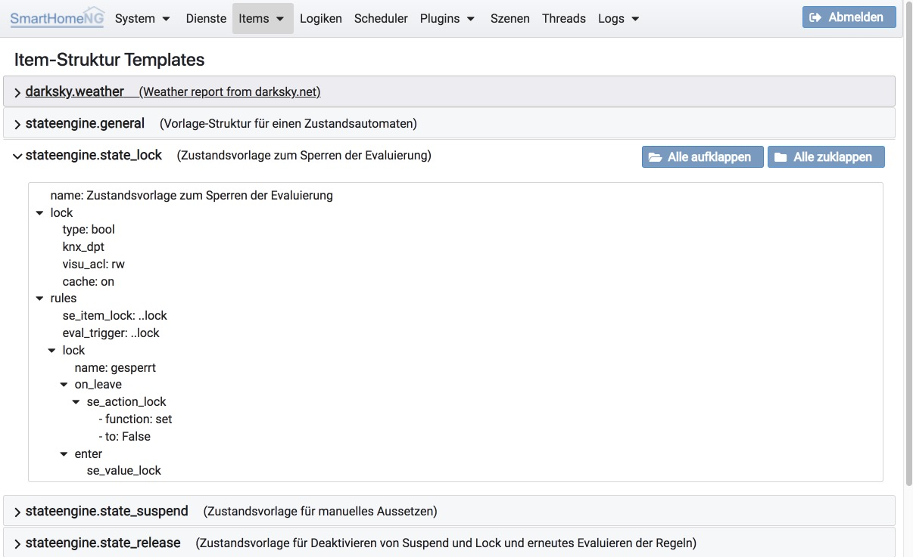
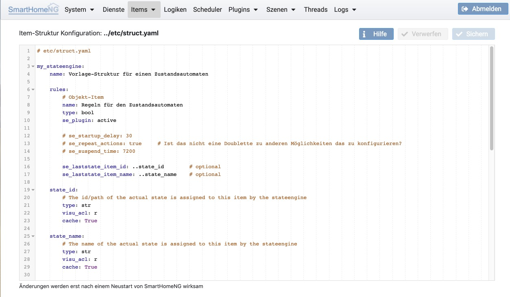

===============
Item Strukturen
===============

Es können Item Struktur Templates angelegt werden, um sich wiederholende Strukturen einfacher zu verwalten. Item
Strukturen können in Plugins und individuell für die Installation von SmartHomeNG angelegt werden.

Struktur Templates
==================

Hier werden alle zur Verfügung stehenden Struktur Templates angezeigt. Das sind die Struktur Templates die von Plugins
definiert werden, die aktuell in SmartHomeNG konfiguriert sind und die in ../etc/structs.yaml konfigurierten Strukturen.
Strukturen aus Plugins sind daran zu erkennen, dass der Name der Item Struktur mit dem Namen des Plugins beginnt, an den
sich mit einem Punkt getrennt der eigentliche Name der Struktur anschließt.

Struktur Konfiguration
======================

Hier können eigene Struktur Templates konfiguriert werden, die in der Datei ../etc/structs.yaml gespeichert werden.

.. index:: Struktur Templates
.. index:: Items; Struktur Templates

