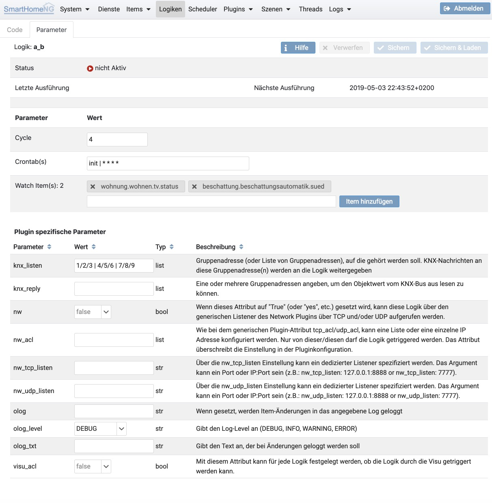

.. index:: Logiken; Editor

============
Logik Editor
============

Der Logik Editor ermöglicht es Logiken zu erstellen oder zu ändern, sowie die Parameter zu konfigurieren, welche die
Ausführung der Logik steuern.

Code Editor
===========

Das Tab mit dem Code Editor ermöglicht den Python Code der Logik zu erfassen/zu ändern.

Parameter
=========

Das Tab mit den Parametern ermöglicht die Konfiguration der Ausführung der Logik. Hier können verschiedene Trigger
für die Logik konfiguriert werden.

