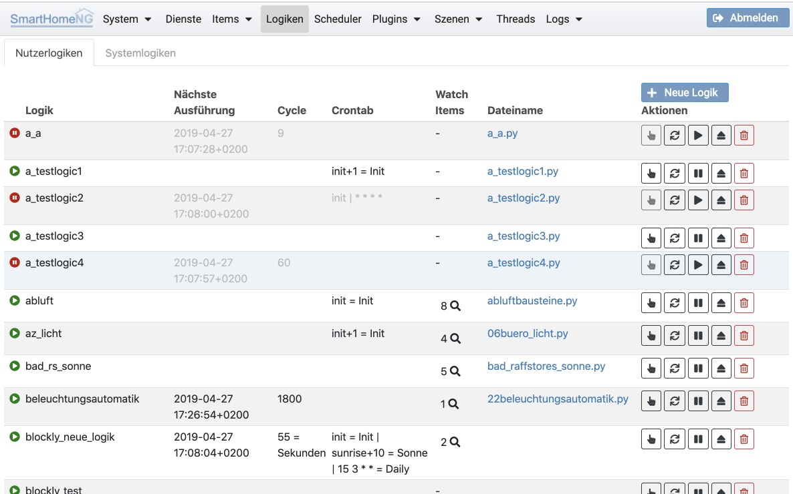

.. index:: Administrations GUI; Logiken
.. index:: Logiken

=======
Logiken
=======

Unter **Logiken** wird eine Liste der konfigurierten Logiken mit einer Reihe von Informationen angezeigt.
Rechts in der jeweiligen Zeile sind Icons über die

- eine Logik ausgelöst (getriggert) werden kann,
- eine Logik neu geladen werden kann,
- eine Logik deaktiviert bzw. aktiviert werden kann,
- eine Logik entladen werden kann,
- eine Logik inclusive Code und Parametern gelöscht werden kann

Oberhalb der Liste findet sich ein Button, der die Erstellung einer neuen Logik ermöglicht.

.. toctree::
   :maxdepth: 4
   :hidden:
   :titlesonly:

   logicconfig

