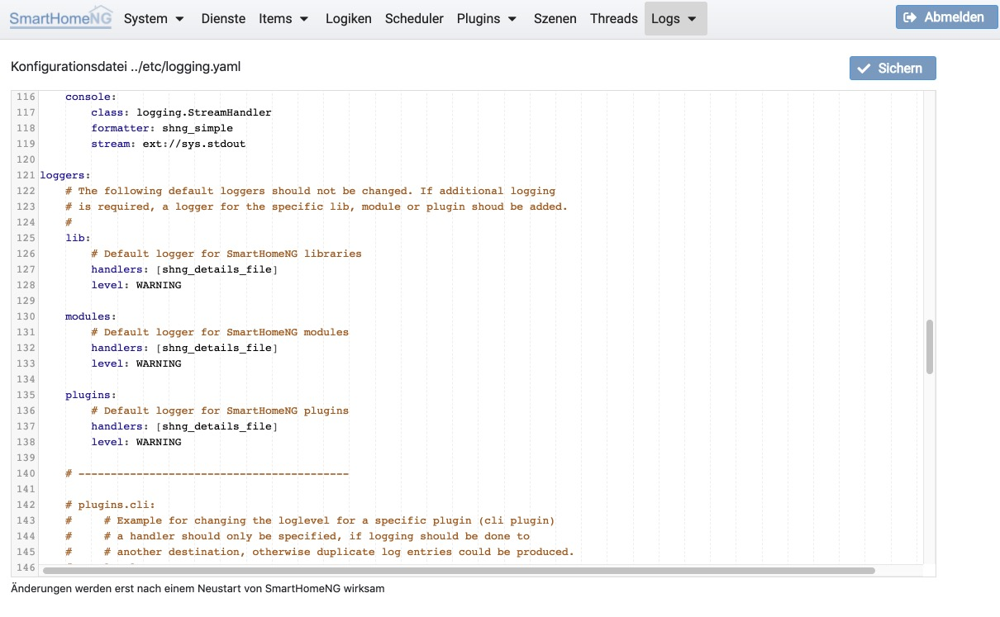

.. index:: Logging; Konfiguration

=====================
Logging Konfiguration
=====================

Unter **Konfiguration** kann das Logging vollständig konfiguriert werden. Hierzu wird die Konfigurationsdatei
**logging.yaml** direkt editiert. Änderungen an der Konfiguration werden erst wirksam, wenn SmartHomeNG neu gestartet
wird.

