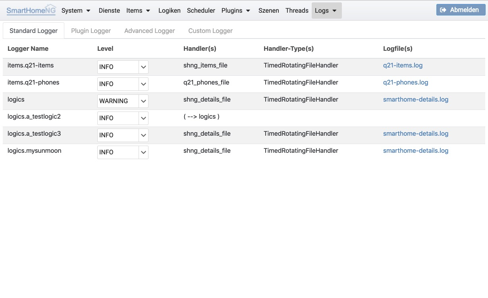

.. index:: Logging; Liste der Logger

================
Liste der Logger
================

Unter **Liste der Logger** können die von SmartHomeNG verwendeten Logger angezeigt werden. Die Logger sind der
Übersichtlichkeit halber auf vier Tabs verteilt.

Der Log-Level eines Loggers kann hier zur Laufzeit verändert werden (ohne dass SmartHomeNG neu gestartet werden muss).
Über die Links in der Spalte **Logfile(s)** kann zur Anzeige des entsprechenden Logs verzweigt werden.

Aus der Liste geht hervor, über welchen Log-Handler die Einträge in welches Log geschrieben werden (siehe auch Abschnitt
Konfiguration/Logging).

Auf dem Screenshot ist zu sehen, wie das Logging einzelner Logiken unterschiedlich konfiguriert ist. Es gibt einen
Logger **logics**, der WARNINGS (oder höher) aus allen Logiken in das Logfile **smarthome-details.log** schreibt.
Abweichend davon, ist ein Logger für die Logik **a_testlogic2** definiert, der INFOs (oder höher) loggt und zwar über
den Standardhandler für Logiken (es ist in der Konfiguration kein Handler angegeben).

Für Logik **a_testlogic3** ist außer dem Loglevel auch ein Handler definiert. Das sorgt dafür, dass die Logeinträge
in das im Handler definierte Log geschrieben werden (hier das gleiche Log, welches auch für den Standard Logger für
Logiken verwendet wird).
