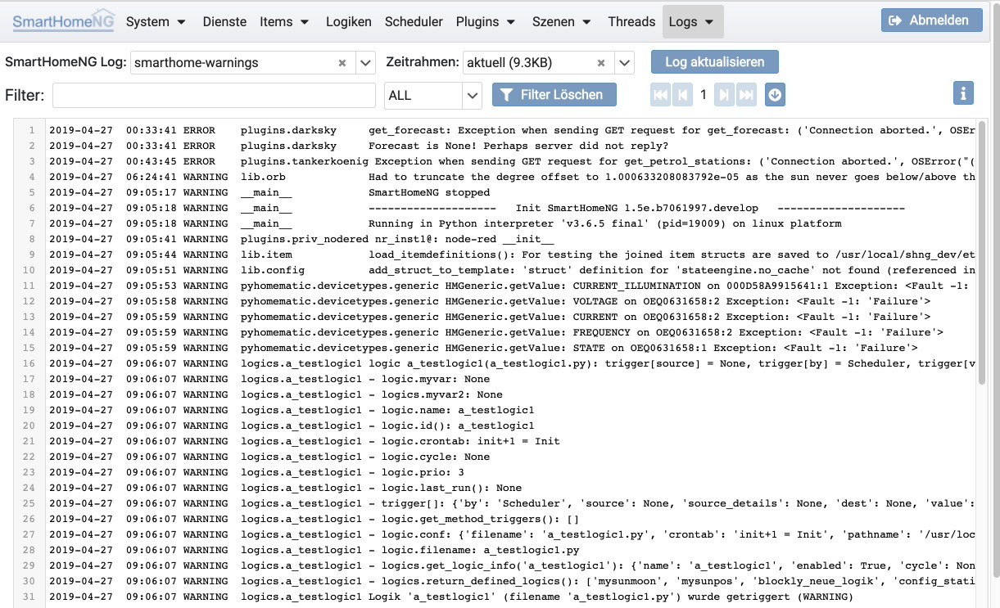

.. index:: Logs
.. index:: Logging
.. index:: Logging; Anzeige

====
Logs
====

Unter **Logs** können die in SmartHomeNG erzeugten Logeinträge angezeigt werden. Das anzuzeigende Log wird in der
ersten Drop-Down Liste angezeigt. Daneben können unter Zeitrahmen die Logs vergangener Tage ausgewählt werden, falls
ein für ein Log ein **TimedRotatingFileHandler** genutzt wurde. Mit dem Button **Log aktualisieren** wird das Log
aktuell vom SmartHomeNG Server angefordert.

In der zweiten Zeile können die Logeinträge gefiltert werden. Dazu steht ein Freitextfilter zur Verfügung. Dieser Filter
ist Case-Sensitive. Zusätzlich können die Logeinträge nach Log-Level gefiltert werden.

-----------------
Große Log Dateien
-----------------

Große Log Dateien werden nicht als ganzes, sondern in Stücken (Chunks) eingelesen. Standardmäßig ist ein Chunk 1000
Log-Einträge (Zeilen) lang. Die gewünschte Größe der Chunks kann in der Konfiguration (unter System/Konfiguration im
Tab 'Admin Modul') konfiguriert werden.

.. note::

   Log-Einträge mit einem Traceback werden hierbei zusammen mit dem Traceback als ein Eintrag gezählt.

Wenn ein Log länger als die gewählte Chunk Größe ist, kann mit den Navigations-Buttons ein Chunk weiter oder zurück
navigiert werden. Außerdem kann zum ersten Chunk zurück gesprungen werden oder zum letzten Chunk vor gesprungen werden.
Je nach Größe des Logs kann das einen Moment dauern, da dazu im Hintergrund das gesamte Log gelesen wird.

.. toctree::
   :maxdepth: 4
   :hidden:
   :titlesonly:

   logs-logger-list
   logs-configuration

