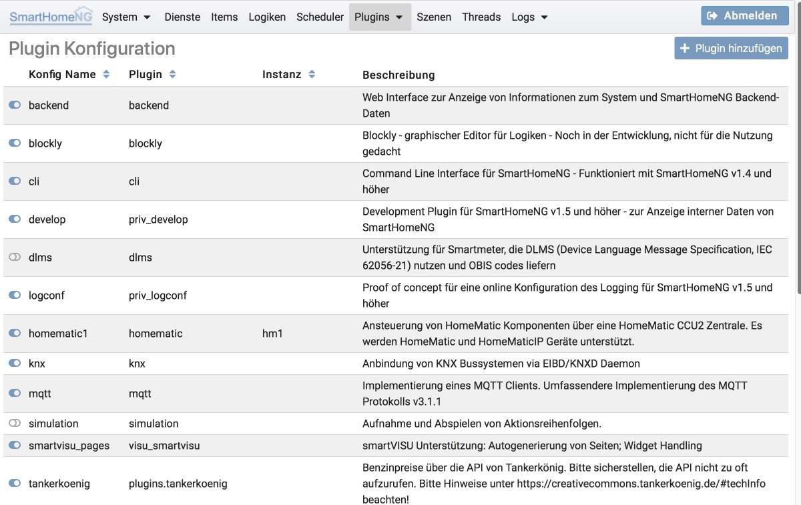
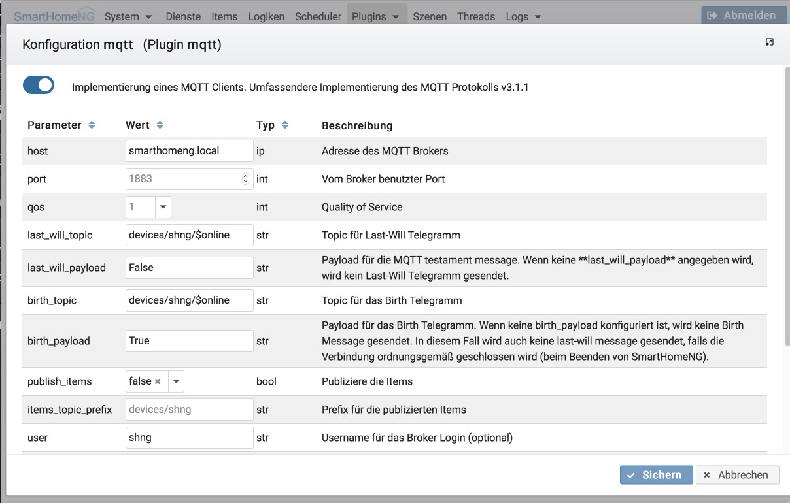

.. index:: Plugin Konfiguration

====================
Plugin Konfiguration
====================

Hier können die Plugins für die SmartHomeNG Installation konfiguriert werden.

Liste der konfigurierten Plugins
================================

Die Liste der konfigurierten Plugins zeigt alle Konfigurationen an, die in ../etc/plugin.yaml gespeichert sind. Der
Schiebeschalter links in jeder Zeile zeigt ob das Plugin aktiviert ist. Falls nicht, ist es nicht geladen bzw. wird bei
einem Neustart nicht geladen.

Durch anklicken einer Zeile, wird ein Dialog aktiviert um die Konfiguration des jeweiligen Plugins anzupassen.

Falls eine Plugin Konfiguration geändert wird oder eine neue Plugin Konfiguration hinzugefügt wird, wird der Button am
unteren Ende der Liste aktiviert, mit dem SmartHomeNG neu gestartet werden kann um die Änderungen zu aktivieren.

Konfigurationsdialog eines Plugins
==================================

Über den Schiebeschalter oben links kann die Plugin Konfiguration aktiviert oder deaktiviert werden.

Default Werte werden in grau angezeigt. Um zu den Standardwerten zurückzukehren, muss nur der Feldinhalt gelöscht werden,
bzw. bei Auswahl Listen der Wert über das **x** neben dem Wert gelöscht werden.

Falls eine Konfiguration nicht nur deaktiviert, sondern endgültig gelöscht werden soll, so kann das über den **Löschen**
Button erfolgen.

