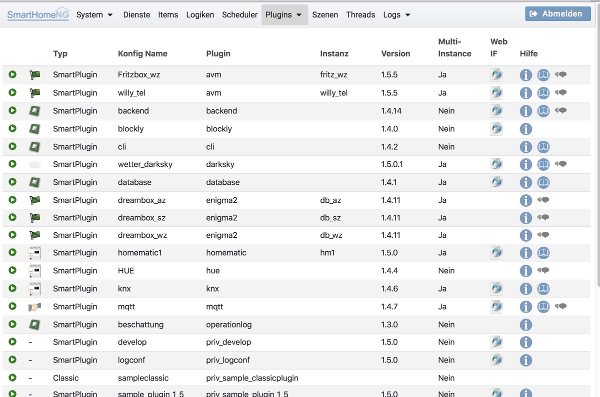

.. index:: Plugins

=======
Plugins
=======

Unter **Plugins** wird eine Liste der konfigurierten Plugins mit einer Reihe von Informationen zu den Plugins angezeigt.
Rechts in der jeweiligen Zeile sind Icons über die (falls vorhanden)

- das Web Interface des Plugins gestartet werden kann,
- die Konfigurations-Dokumentation zu dem Plugin aufgerufen werden kann,
- die weitergehende Anwender-Dokumentation des Plugins aufgerufen werden kann,
- der Support Thread zu dem Plugin im SmartHomeNG Forum aufgerufen werden kann

.. note::

   Webinterfaces von Plugins können die durch das Admin Interface genutzte Art der Authentifizierung noch nicht
   erkennen/nutzen. Deshalb erscheint beim ersten Aufruf eines Web Interfaces der Basic-Auth Anmeldedialog des Browsers
   und es muss eine Anmeldung mit Username/Passwort des Admin Interfaces erfolgen.

.. toctree::
   :maxdepth: 4
   :hidden:
   :titlesonly:

   pluginconfig

