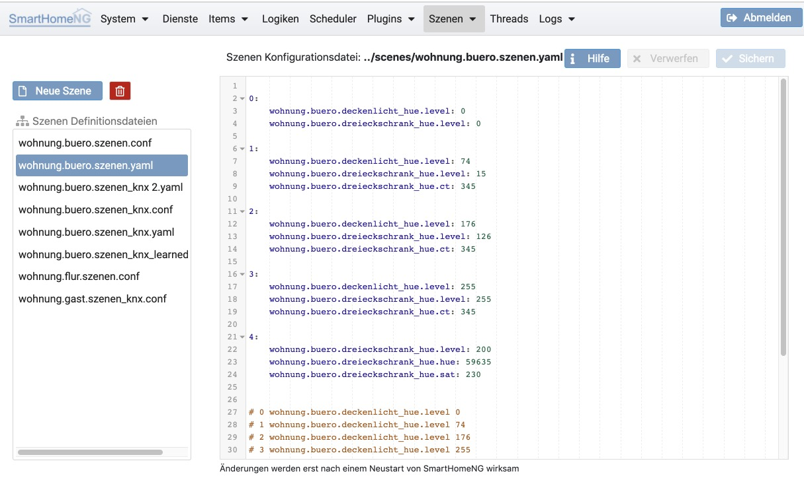

.. index:: Szenen

====================
Szenen Konfiguration
====================

Hier können die Definitionen von Szenen bearbeitet werden. Auf der linken Seite können Szenen-Konfigurationsdateien
angelegt, gelöscht oder zur Bearbeitung ausgewählt werden.

Eine Dialog-gestützte Konfiguration von Szenen (analog zur Plugin Konfiguration) wird in einem kommenden Release von
SmartHomeNG hinzu kommen.

