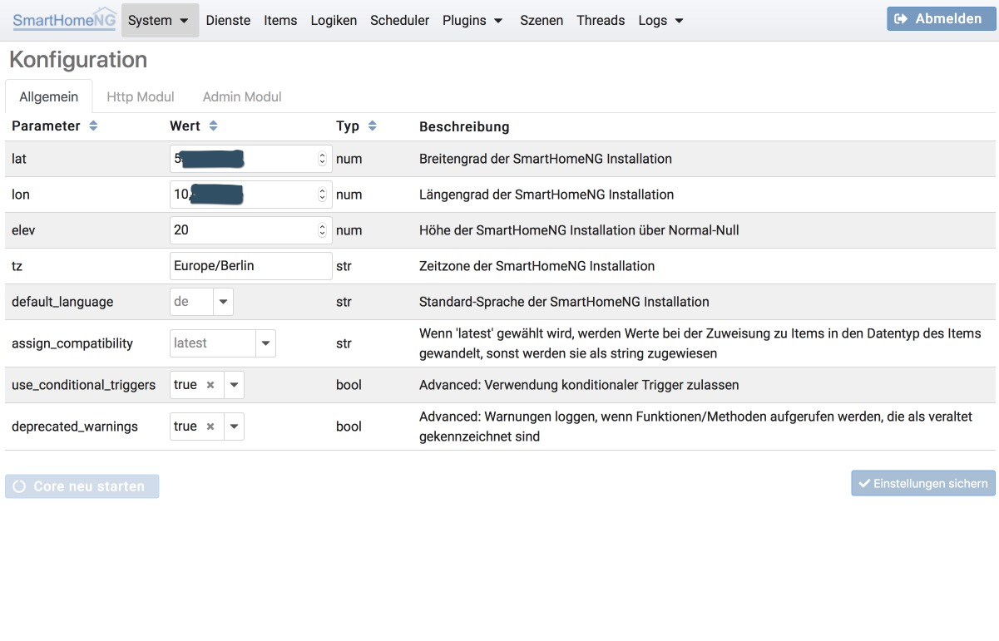
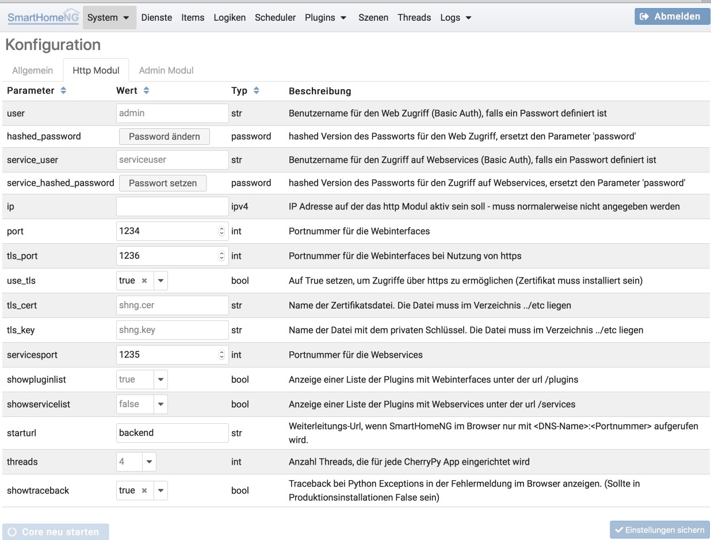
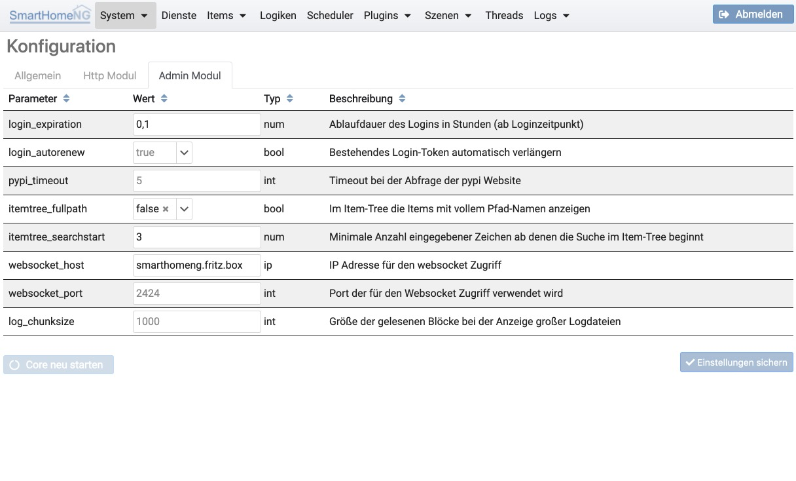
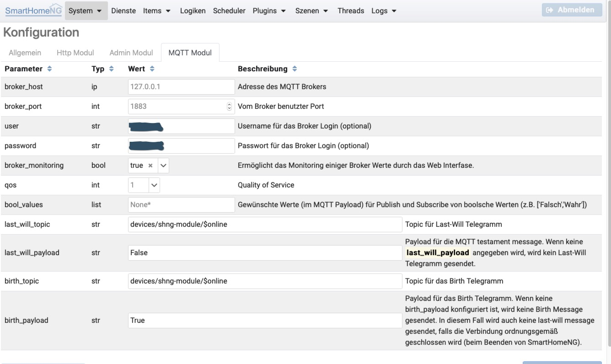

.. index:: System Konfiguration

====================
System Konfiguration
====================

In der System Konfiguration können der Core und die Core Module konfiguriert werden.


.. index:: Konfiguraton; System, allgemein

Allgemein
=========

In diesem Tab werden die allgemeinen Einstellungen für SmartHomeNG konfiguriert. Es handelt sich hierbei um die Einstellungen,
die in der Konfigurationsdatei ../etc/smarthome.yaml abgelegt sind.



Der Button ```Core neu starten``` wir erst aktiv, wenn geänderte Einstellungen gesichert wurden.


.. index:: Konfiguration; http
.. index:: http; Konfiguration (Admin GUI)

Http Modul
==========

Im Tab für das http Modul werden die Einstellungen für das http Modul konfiguriert. Die Anmeldeinformation wird sowohl
vom http Modul (Basic Auth), als auch vom Admin Modul (JWT Token) genutzt. Passworte werden hierbei nur als Hash in die
Konfiguration geschrieben und NICHT im Klartext. Ein vergessenes Passwort kann daher nicht wieder sichtbar gemacht werden.
Es handelt sich hierbei um die Einstellungen, die in der Konfigurationsdatei ../etc/module.yaml im Abschnitt http: abgelegt
sind.




.. index:: Konfiguration; Admin Modul
.. index:: Admin Modul; Konfiguration

Admin Modul
===========

In diesem Tab werden die Einstellungen für das Admin Modul konfiguriert. Es handelt sich hierbei um die Einstellungen,
die in der Konfigurationsdatei ../etc/module.yaml im Abschnitt ``admin:`` abgelegt sind.



Falls ein Username und ein Password konfiguriert sind, steuern die folgenden zwei Parameter die Gültigkeitsdauer der
Anmeldung. Die Anmeldung wird über ein Token gesteuert, welches auch bei Beendigung des Browsers erhalen bleibt. Es
wird bei Klick auf den Abmelden Button gelöscht oder es verfällt nach Ablauf der Gültigkeitsdauer.

Der Parameter **login_experiation** legt die Gültigkeitsdauer (in Stunden) des bei der Anmeldung ausgestellten Tokens
fest. Falls eine kurze Gültigkeit gewünscht ist, können auch Werte kleiner 1 angegeben werden. (0.5 bedeutet z.B. eine
Gültigkeit von 30 Minuten).

Der Parameter **login_autorenew** legt fest, ob bei Nutzung des Administrations-Interfaces die Gültigkeit des Tokens
verlängert wird oder nicht. Wenn **login_autorenew** auf **true** gesetzt ist, wird bei einer Nutzung des
Administrations-Interfaces nach Ablauf der halben Gültigkeits-Dauer das Token erneuert, so dass es wieder die volle
mit **login_experiation** festgelegte Dauer gültig ist.


.. index:: Konfiguration; mqtt
.. index:: mqtt Konfiguration

MQTT Modul
==========

In diesem Tab werden die Einstellungen für Nutzung des MQTT Protokolls konfiguriert. Es handelt sich hierbei um die
Einstellungen, die in der Konfigurationsdatei ../etc/module.yaml im Abschnitt ``mqtt:`` abgelegt sind.



