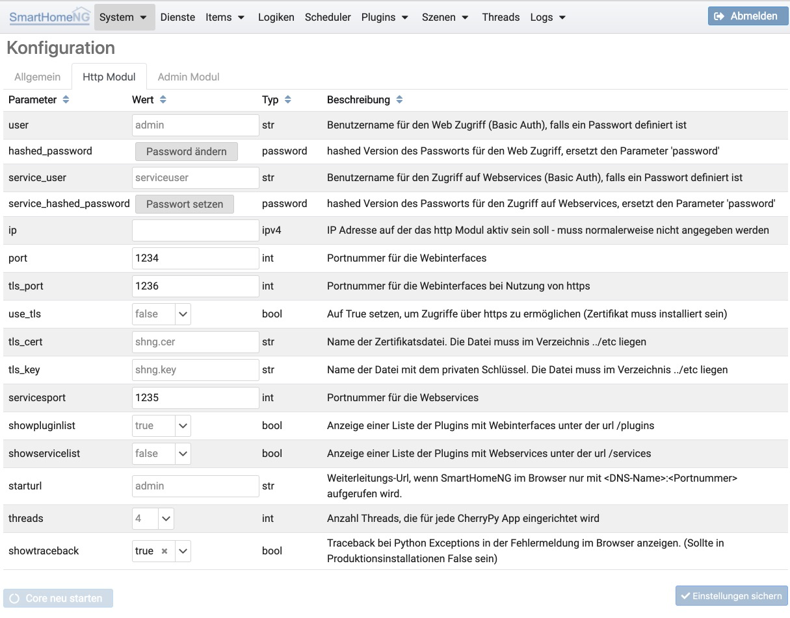
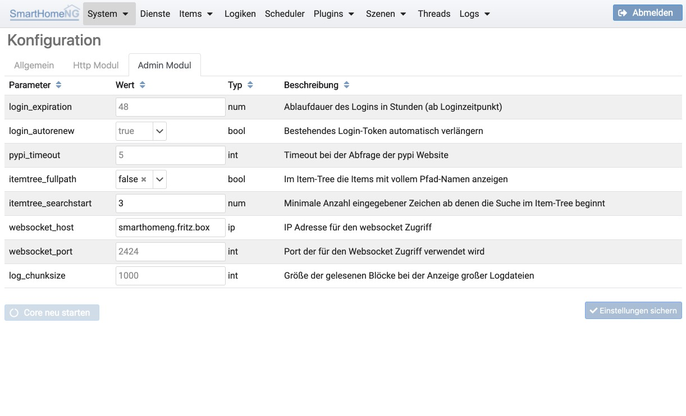

.. index:: System Konfiguration

====================
System Konfiguration
====================

In der System Konfiguration können der Core und die Core Module konfiguriert werden.

Allgemein
=========

In diesem Tab werden die allgemeinen Einstellungen für SmatHomeNG konfiguriert. Es handelt sich hierbei um die Einstellungen,
die in der Konfigurationsdatei ../etc/smarthome.yaml abgelegt sind.

.. image:: assets/system-common.jpg
   :class: screenshot

Http Modul
==========

Im Tab für das http Modul werden die Einstellungen für das http Modul konfiguriert. Die Anmeldeinformation wird sowohl
vom http Modul (Basic Auth), als auch vom Admin Modul (JWT Token) genutzt. Passworte werden hierbei nur als Hash in die
Konfiguration geschrieben und NICHT im Klartext. Ein vergessenes Passwort kann daher nicht wieder sichtbar gemacht werden.
Es handelt sich hierbei um die Einstellungen, die in der Konfigurationsdatei ../etc/module.yaml im Abschnitt http: abgelegt
sind.

Admin Modul
===========

In diesem Tab werden die Einstellungen für das admin Modul konfiguriert. Es handelt sich hierbei um die Einstellungen,
die in der Konfigurationsdatei ../etc/module.yaml im Abschnitt admin: abgelegt sind.

