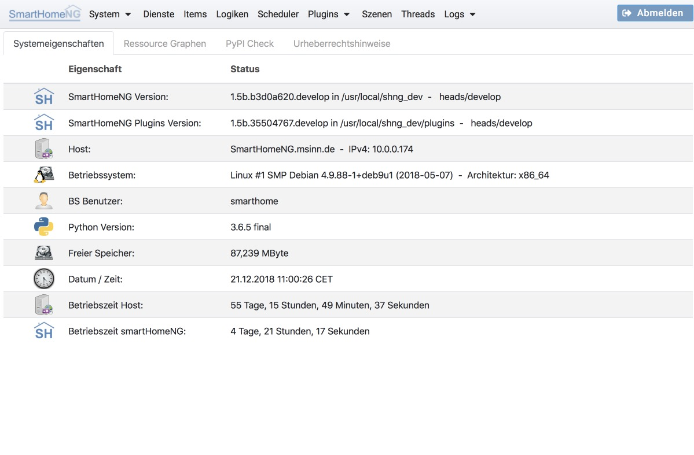
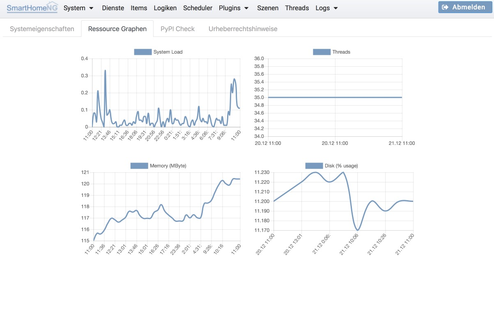
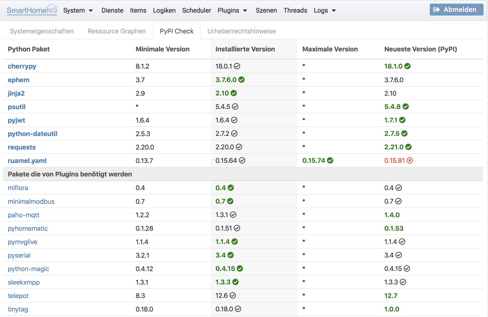
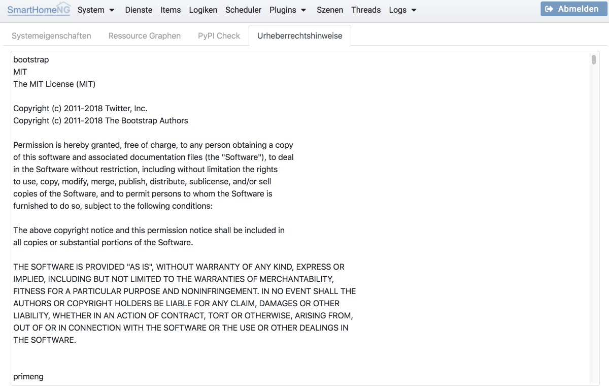

.. index:: System

======
System
======

.. index:: Systemeigenschaften; Übersicht

Übersicht
=========

Die Übersichtsseite zeigt eine Reihe von Informationen über die SmartHomeNG Installation und das System an, auf dem
SmartHomeNG läuft.

.. index:: Ressource Graphen
.. index:: Systemeigenschaften; Ressource Graphen

Ressource Graphen
=================

Das Tab mit den Resource Graphen zeigt Graphen über System Load, Anzahl Threads, Speicherbelegung und Plattennutzung an.
Drei dieser Graphen sind bereits aus der Konfigurationsseite der smartVISU bekannt.

.. index:: PyPI Check
.. index:: Systemeigenschaften; PyPI Check

PyPI Check
==========

Das Tab PyPI Check zeigt Informationen über die Versionsstände von benötigten und installierten Python Packages an.
Dabei werden im ersten Block Informationen über Packages angezeigt, die vom Core benötigt werden. Im zweiten Block
werden Informationen über Packages gezeigt, die von Plugins benötigt werden.

Der letzte Block zeigt Informationen über weitere installierte Packages an.

Zu jedem Package werden vier Spalten mit Versionsummern angezeigt. Die erste Spalte zeigt die **minimale Version** eines
Packages, die von SmartHomeNG bzw. den Plugins benötigt wird.

Die zweite Spalte zeigt die aktuell **installierte Version** des Packages an, gefolgt von einem Haken, falls diese Version
von SmartHomeNG bzw. den nutzenden Plugins unterstützt wird. Falls die installierte Version die neueste verfügbare Version
oder die maximal unterstützte Version ist, wird der Eintrag in grün dargestellt.

Die dritte Spalte zeigt die **maximale Version** an, die von SmartHomeNG unterstützt wird. Ein **Stern (Asterix)** zeigt
an, dass es keine definierte maximale Version gibt, dass also die neueste Version genutzt werden kann.

Die vierte Spalte zeigt die **Neueste Version** an, die von pypi.org bezogen werden kann. Wenn die neueste Version für die
SmartHomeNG Installation genutzt werden kann, wird neben der Versionsnummer ein Haken angzeigt. Falls sie installierte
Version nicht der neuesten Version entspricht, wird die neueste Version in grün dargestellt, um darauf hinzuweisen, dass
auf diese Version aktualisiert werden kann. Falls die neueste Version nicht genutzt werden kann, wenn sie also kleiner
als eine angegebene Maximalversion ist, wird die Versionsnummer in rot angezeigt.

.. index:: Urheberrechtshinweise
.. index:: Systemeigenschaften; Urheberrechtshinweise

Urheberrechtshinweise
=====================

Auf diesem Tab werden die Urheberrechtshinweise für die Komponenten angezeigt, die zur Erstellung der Administrationsoberfläche
genutzt wurden.

.. toctree::
   :maxdepth: 4
   :hidden:
   :titlesonly:

   systemconfig

