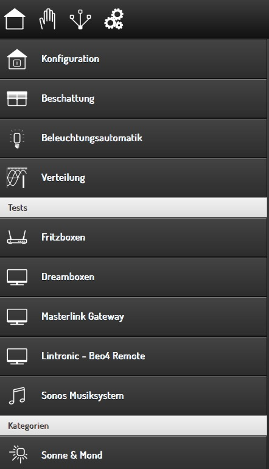

.. index:: smartVISU Autogenerierung; Trenner in der Navigation

Trenner in der Navigation
=========================

Möglichkeiten
-------------

Das folgende Beispiel zeigt die Möglichkeiten zur Anzeige von Trennern
in der Navigation. Zwischen den Navigationseinträgen können mehrere
Trenner angezeigt werden. Das Beispiel zeigt nicht die Raum-Navigation,
sondern die Navigation auf der Konfigurationsseite.

   Navigation Trenner

Das Beispiel zeigt folgende Trenner: - Tests - Kategorien

Am Beispiel des Trenners **``Tests``** zeigt die folgende Konfiguration,
wie Trenner konfiguriert werden:

.. code-block:: yaml

    %YAML 1.1
    ---

    config:

        verteilung:
            name: Verteilung
            sv_page: category
            sv_img: measure_current.png

        separator_test:
            name: Tests
            sv_page: cat_separator

        fritzboxen:
            name: Fritzboxen
            sv_page: category
            sv_img: it_router.png

``sv_page`` ist zum generieren eines Trenners auf einen speziellen
Seitentyp einzustellen. - Wenn ein Trenner in die normale Raumnavigation
eingefügt werden soll, so muss **``sv_page = separator``** angegeben
werden. - Wenn ein Trenner in die Konfigurationsnavigation eingefügt
werden soll, so muss **``sv_page = cat_separator``** angegeben werden.
