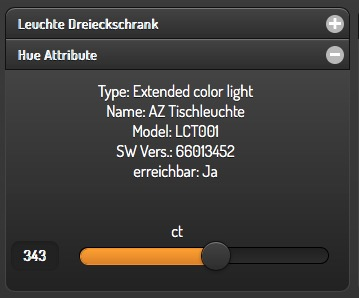
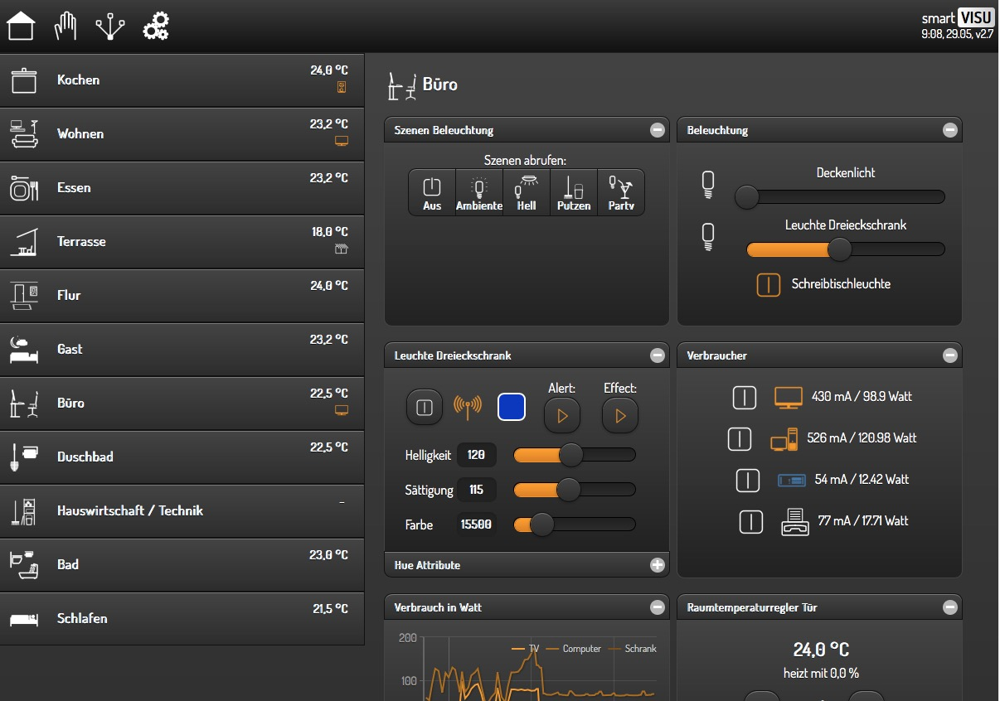

Unterschiedliche Blocktypen
===========================

Möglichkeiten
-------------

Die smartVISU unterstützt Blöcke zusätzlich zu den Standard-Blöcken auch
Blöcke mit “2 Seiten”, die in den bisherigen Releases von
smarthome.py/SmartHomeNG nicht unterstützt wurden.

Im aktuellen Release können auch diese Dual-Blöcke in der automatischen
Seitengenerierung verwendet werden.

Hier ein Beispiel, wie ein solcher DualBlock aussehen kann:

.. figure:: assets/blocktype_dual_1.jpg
   :alt: Dual-Block

   Dual-Block

   Dual-Block 2

Ein solcher Dual-Block hat immer die Größe eines großen Blocks. Damit
die Visu-Seite “aufgeräumt” aussieht, sollte für den daneben liegenden
Block die große Form gewählt werden (``sv_blocksize = 1``). Diehe dazu
auch Seite `Unterschiedliche
Blockgrößen <https://github.com/smarthomeNG/smarthome/wiki/visu_smartvisu_autogen_blocksizes>`__.

Hier ist ein Beispiel auf einer Visu Seite:

   Navigation Trenner
