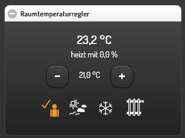
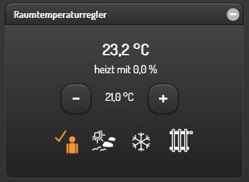
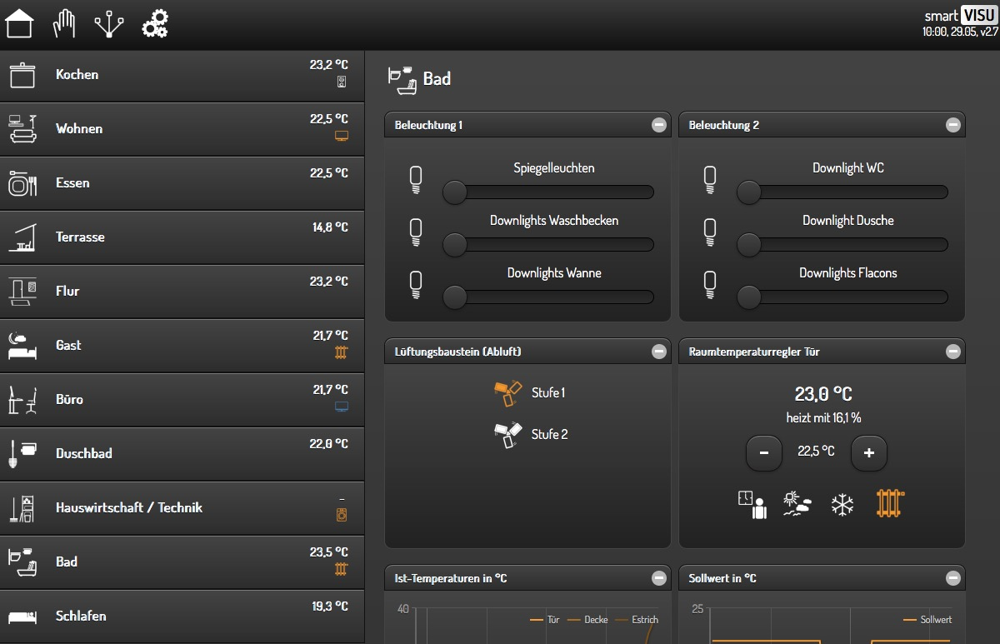

Unterschiedliche Visu-Styles
============================

Möglichkeiten
-------------

Das folgende Beispiel zeigt die Möglichkeiten zur Auswahl des Styles der
für smartVISU generierten Seiten.

Bisher wurden Blöcke generiert, die so aussahen (Style ‘Standard’):

   Style Standard

In der aktuellen Version ist es möglich, die Blöcke in folgender Optik
generieren zu lassen (Style ‘Black’):

   Style Black

Dieses ist eine Visu-weite Einstellung, die in der Datei
/etc/plugin.conf vorgenommen wird. Dort kann ``visu_style: std``
oder ``visu_style: blk`` eingetragen werden.

Eine vollständige Seite im Style **Black** sieht z.B. folgendermaßen aus:

   Visu Black
