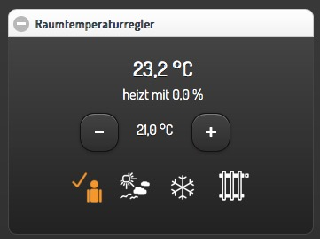
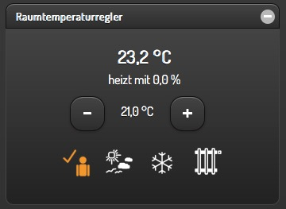
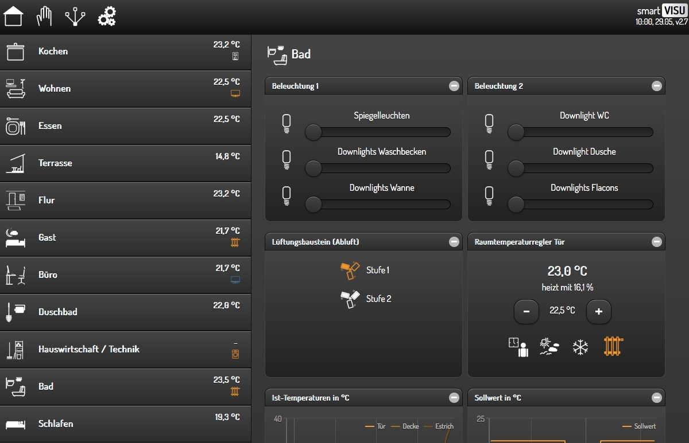

:tocdepth: 4

.. index:: Visualisierung mit smartVISU
.. index:: smartVISU

############################
Visualisierung mit smartVISU
############################

=========
Überblick
=========

Im Release 1.2 wurde die Unterstützung für die smartVISU weiterentwickelt. Dabei wurde das
Visu Plugin durch zwei neue Plugins ersetzt.

In SmartHomeNG v1.2 und v1.3 wurden die smartVISU Versionen v2.7 und v2.8 unterstützt.
Mit SmartHomeNG v1.4 kam Unterstützung für smartVISU Versionen v2.9 hinzu.

- Das erste Plugin (**visu_websocket**) implementiert das Websocket Protokoll über das smartVISU
  mit SmartHomeNG kommuniziert.
- Das zweite Plugin (**visu_smartvisu**) implementiert die aus den bisherigen Releases bekannte
  Möglichkeit zur automatischen Generierung von smartVISU Seiten. Diese Funktion wurde stark
  erweitert. Weiterhin ermöglicht dieses Plugin die Installation von Widgets in die smartVISU,
  die die Entwickler von SmartHomeNG Plugins geschrieben und ihren Plugins beigefügt haben.

Das smartVISU Plugin implementiert:

- eine erweiterte Möglichkeit zum automatischen Generieren von smartVISU Seiten
- die Fähigkeit zur Widget Installation in die smartVISU, die es Plugin Entwicklern ermöglicht,
  mit ihrem  Plugin smartVISU Widgets auszuliefern.

Änderungen ab Version 1.2
=========================

In den bisherigen Releases von smarthome bzw. SmartHomeNG wurde die Visualisierungsunterstützung
in der Datei **../etc/plugin.yaml** folgendermaßen konfiguriert:

.. code-block:: yaml
   :caption: Ausschnitt aus **../etc/plugin.yaml**

   visu:
       plugin_name: WebSocket
       class_path: plugins.visu
   #    ip: 0.0.0.0
   #    port: 2424
       smartvisu_dir: /var/www/smartvisu
   #    acl: rw

Ab SmartHomeNG v1.2 sind für die vollständige smartVISU Unterstützung zwei Plugins an Stelle des bisherigen
visu Plugins zu konfigurieren.

.. code-block:: yaml
   :caption: Ausschnitt aus **../etc/plugin.yaml**

   websocket:
       pliugin_name: visu_websocket
   #    ip: 0.0.0.0
   #    port: 2424
   #    tls: no
   #    wsproto: 4
       acl: rw

   smartvisu:
       plugin_name: visu_smartvisu
       smartvisu_dir: /var/www/smartvisu
   #    generate_pages: True
   #    handle_widgets: True
   #    overwrite_templates: Yes
   #    visu_style: blk

Für die vollständige Dokumentation der Parameter bitte in den README Dateien der beiden Plugins
oder auf den folgenden Seiten dieser Dokumentation nachlesen:

- für das **visu_websocket** unter :doc:`../plugins/visu_websocket/README`
- für das **visu_smartvisu** unter :doc:`../plugins/visu_smartvisu/README`

Falls die Funktionalitäten zur automatischen Generierung von smartVISU Seiten und zur Installation
von Widgets in die smartVISU nicht benötigt werden, ist es hinreichend das Plugin **visu_websocket**
zu konfigurieren.

.. index:: smartVISU; Kommunikation mit der Visu

==========================
Kommunikation mit der Visu
==========================

Die Kommunikation zwischen SmartHomeNG und der smartVISU wird auf Seite von SmartHomeNG durch
das Plugin **visu_websocket** gesteuert. Auf Seite der smartVISU wird die Kommunikation über
den Treiber **io_smarthome.py.js** abgewickelt. Dieser Treiber is in Javascript geschrieben
und ermöglicht die Kommunikation des Browsers der die Visu anzeigt mit dem Websocket Plugin
von SmartHomeNG.

.. important::

   Die Kommunikation findet zwischen dem Browser und SmartHomeNG statt, NICHT zwischen dem
   Webserver und SmartHomeNG. Der Webserver liefert nur den statischen Kontent der Visu aus.

Das Plugin **visu_websocket** muss in **../etc/plugin.yaml** konfiguriert werden.

.. code-block:: yaml
   :caption: Ausschnitt aus **../etc/plugin.yaml**

   websocket:
       class_name: WebSocket
       class_path: plugins.visu_websocket
   #    plugin_name: visu_websocket
   #    ip: 0.0.0.0
   #    port: 2424
   #    tls: no
   #    wsproto: 4
       acl: rw

+-------------+-----------------------------------------------------------------------------------+
| Parameter   | Beschreibung                                                                      |
+=============+===================================================================================+
| class_name  | class_name muss wie im obigen Beispiel angegeben werden. Kann ab SmartHomeNG v1.4 |
|             | durch den Parameter plugin_name ersetzt werden.                                   |
+-------------+-----------------------------------------------------------------------------------+
| class_path  | class_path muss wie im obigen Beispiel angegeben werden. Kann ab SmartHomeNG v1.4 |
|             | durch den Parameter plugin_name ersetzt werden.                                   |
+-------------+-----------------------------------------------------------------------------------+
| ip          | Muss normalerweise nicht angegeben werden. Hiermit wird für Computer mit mehreren |
|             | ip Adressen festgelegt, auf welcher Adresse das Plugin hört. Wenn ip nicht        |
|             | angegeben ist, hört das Plugin auf allen ip Adressen des Computers.               |
+-------------+-----------------------------------------------------------------------------------+
| port        | Muss normalerweise nicht angegeben werden. Hiermit wird festgelegt auf welchem    |
|             | Port das Plugin hört. Wenn der Parameter nicht angegeben wird, hört das Plugin    |
|             | auf Port 2424.                                                                    |
+-------------+-----------------------------------------------------------------------------------+
| tls         | Muss normalerweise nicht angegeben werden. Wenn tls auf yes gesetzt wird,         |
|             | kommuniziert das Plugin verschlüsselt. Dazu müssen im Verzeichnis **../etc**      |
|             | gültige Zertifikatdateien **home.crt**, **home.key** und **ca.crt** abgelegt      |
|             | werden.                                                                           |
+-------------+-----------------------------------------------------------------------------------+
| wsproto     | Spezifiziert die Protokoll Version der Websocket Kommunikation zwischen smartVISU |
|             | und SmartHomeNG. Wird der Parameter nicht angegeben, wird **wsproto: 4** genutzt. |
|             | Es ist nur notwendig diesen Parameter anzugeben, wenn man noch smartVISU v2.7     |
|             | nutzt. Dann muss **wsproto: 3** angegeben werden.                                 |
+-------------+-----------------------------------------------------------------------------------+
| acl         | Mit dem Parameter **Accesscontrol list** kann eine generelle Voreinstellung für   |
|             | den Zugriff der Visu auf Items vorgenommen werden. Wenn im Item kein Attribut     |
|             | **acl:** gesetzt ist, wird die Einstellung dieses Parameters genutzt. Mögliche    |
|             | Werte sind **ro** (Read Only) und **rw** (Read/Write)                             |
+-------------+-----------------------------------------------------------------------------------+

.. toctree::
   :maxdepth: 4
   :hidden:
   :titlesonly:

   reverse_proxy

.. index:: smartVISU; Autogenerierung

========================
Automatische Generierung
========================

Überblick
=========

Im Vergleich zum Visu Plugin der vorhergehenden smarthome.py/SmartHomeNG Releases, wurden die
Möglichkeiten zur automatischen Generierung von Seiten für die smartVISU stark erweitert.
Unterstützt werden smartVISU v2.7, v2.8 und v2.9.

Die zusätzlichen Attribute, die in der item.conf Datei für die Items konfiguriert werden können,
sind in der README Datei des Plugins :doc:`../plugins/visu_smartvisu/README` beschrieben.

Diese Seite und die zugehörien Unterseiten sollen einige der Möglichkeiten aufzeigen, die sich
durch die Erweiterungen bieten. Es ist auch möglich einen Teil der Seiten generieren zu lassen
und einen anderen Teil der Seiten manuell zu erstellen.

Features der Generierung
========================

.. index:: smartVISU Autogenerierung; Zusätzliche Infos in der Navigation anzeigen

Zusätzliche Infos in der Navigation anzeigen
--------------------------------------------

In der Navigation können eine Reihe zusätzlicher Informationen angezeigt werden.

Das folgende Beispiel zeigt die Möglichkeiten zur Anzeige von
zusätzlichen Informationen in der Navigation. Es können zwei Zeilen
angezeigt werden. Im Beispiel wird in der ersten Zeile die aktuelle
Raumtemperatur angezeigt und in der zweiten Zeile werden Icons
angezeigt, die den Zustand von Geräten in dem Raum anzeigen.

   Navigation Zusatzinfos

Das Beispiel zeigt folgendes an:

- Kaffeemaschine auf Standby in der Küche
- TV an im Wohnzimmer
- Im Gästezimmer und im Bad wird geheizt
- Im Büro läuft das TV im Audio Mode
- Die Waschmaschine läuft

Am Beispiel der Küche zeigt die folgende Konfiguration, wie die
zusätzlichen Informationen konfiguriert werden:

.. code-block:: yaml

    %YAML 1.1
    ---

    wohnung:

        kochen:
            name: Kochen
            sv_page: room
            sv_img: scene_cooking.png
            sv_nav_aside: "{{ basic.float('m_kochen.ist', 'wohnung.kochen.heizung.ist', '°') }}"
            sv_nav_aside2: "{{ basic.symbol('m_kochen_kaffee2', 'wohnung.kochen.kaffeeautomat.status', '', 'icons/ws/scene_coffee_maker_automatic.png', '2') }} {{ basic.symbol('m_kochen_kaffee3', 'wohnung.kochen.kaffeeautomat.status', '', 'icons/or/scene_coffee_maker_automatic.png', '3') }} {{ basic.symbol('m_kochen_heizen', 'wohnung.kochen.heizung.heizen', '', icon1~'sani_heating.png') }}"

Wie in den bisherigen Releases:

- ``sv_page`` zeigt an, dass
  [wohnung.kochen] ein Raum ist und für diesen ein Navigationseintrag und
  eine Seite generiert werden soll.
- ``sv_img`` gibt an, welches Icon in
  der Navigation und auf der Seite angezeigt werden soll.

Neu:

- ``sv_nav_aside`` spezifiziert, was an der Seite in der oberen
  Zeile angezeigt werden soll. In diesem Fall ist das die aktuelle
  Raumtemperatur.
- ``sv_nav_aside2`` spezifiziert,was an der Seite in
  der unteren Zeile angezeigt werden soll. In diesem Fall ist das eine
  Reihe von Symbolen:

  – Kaffeeautomat im Standby

  – Kaffeeautomat heizt

  – Die Heizung heizt

Wenn die Stati nicht aktiv sind, werden die jeweiligen Icons nicht
angezeigt. Da der Kaffeeautomat nur entweder im Standby sein kann oder
heizt, wird nur eines der Icons angezeigt. Wenn der Kaffeeautomat
ausgeschaltet ist, wird kein Icon angezeigt.

.. index:: smartVISU Autogenerierung; Konfigurationsseiten

Generierung einer Konfigurations-Navigation
-------------------------------------------

Zusätzlich zum Aufbau einer Navigation über die Seiten der Räume, kann eine Navigation über
mehrere Konfigurationsseiten aufgebaut werden.

Das folgende Beispiel zeigt die Möglichkeiten zum generieren einer
Kategorie Navigation. Die Kategorie Navigation wird durch anklicken des
Hand-Symbols in der Titelzeile der smartVISU aktiviert.

   Kategorie Navigation

Am Beispiel der obigen Konfigurations-Navigation zeigt die nachfolgende
Konfigurationsdatei, wie die Navigation konfiguriert wird:

.. code-block:: yaml

    %YAML 1.1
    ---

    config:

        konfiguration:
            name: Konfiguration
            sv_page: category
            sv_img: control_all_on_off.png

        beschattung:
            name: Beschattung
            sv_page: category
            sv_img: fts_shutter_40.png

        beleuchtung:
            name: Beleuchtungsautomatik
            sv_page: category
            sv_img: light_light_dim_00.png

``sv_page`` ist zum Generieren eines Eintrages für die
Konfigurations-Navigation auf den Seitentyp **``category``**
einzustellen.

.. index:: smartVISU Autogenerierung; Trenner in der Navigation

Trenner in der Navigation
-------------------------

Die Navigation kann durch Trenner unterteilt werden, um die Übersichtlichkeit zu erhöhen.

Das folgende Beispiel zeigt die Möglichkeiten zur Anzeige von Trennern
in der Navigation. Zwischen den Navigationseinträgen können mehrere
Trenner angezeigt werden. Das Beispiel zeigt nicht die Raum-Navigation,
sondern die Navigation auf der Konfigurationsseite.

.. figure:: assets/divider.jpg
   :alt: Navigation Trenner

   Navigation Trenner

Das Beispiel zeigt folgende Trenner: - Tests - Kategorien

Am Beispiel des Trenners **``Tests``** zeigt die folgende Konfiguration,
wie Trenner konfiguriert werden:

.. code-block:: yaml

    %YAML 1.1
    ---

    config:

        verteilung:
            name: Verteilung
            sv_page: category
            sv_img: measure_current.png

        separator_test:
            name: Tests
            sv_page: cat_separator

        fritzboxen:
            name: Fritzboxen
            sv_page: category
            sv_img: it_router.png

``sv_page`` ist zum generieren eines Trenners auf einen speziellen
Seitentyp einzustellen. - Wenn ein Trenner in die normale Raumnavigation
eingefügt werden soll, so muss **``sv_page = separator``** angegeben
werden. - Wenn ein Trenner in die Konfigurationsnavigation eingefügt
werden soll, so muss **``sv_page = cat_separator``** angegeben werden.

.. index:: smartVISU Autogenerierung; Unterschiedliche Visu-Styles

Unterschiedliche Visu-Styles
----------------------------

Zusätzlich zum von bisherigen Releases unterstützen Standard-Style, wird der Style **black**
unterstützt.

Das folgende Beispiel zeigt die Möglichkeiten zur Auswahl des Styles der
für smartVISU generierten Seiten.

Bisher wurden Blöcke generiert, die so aussahen (Style ‘Standard’):

   Style Standard

In der aktuellen Version ist es möglich, die Blöcke in folgender Optik
generieren zu lassen (Style ‘Black’):

   Style Black

Dieses ist eine Visu-weite Einstellung, die in der Datei
/etc/plugin.conf vorgenommen wird. Dort kann ``visu_style: std``
oder ``visu_style: blk`` eingetragen werden.

Eine vollständige Seite im Style **Black** sieht z.B. folgendermaßen aus:

   Visu Black

.. index:: smartVISU Autogenerierung; Unterschiedliche Blockgrößen

Unterschiedliche Blockgrößen
----------------------------

Die Blöcke in denen Widgets angezeigt werden, hatten in den bisherigen Releases eine fest
definierte (Mindest-)Größe. Jetzt stehen drei unterschiedliche Mindestgrößen zur Verfügung.

Die smartVISU unterstützt Blöcke mit drei unterschiedlichen Größen.
Gemeint ist hierbei die Mindestgröße des Blocks. Wenn in dem Block
Widgets platziert werden, die mit dem Platz nicht auskommen, wird der
Block automatisch höher. Die Blockhöhen unterscheiden sich in etwa um
die Höhe der Heading-Zeile.

In den bisherigen Releases von smarthome.py/SmartHomeNG wurden beim
automatischen generieren von smartVISU Seiten immer Blöcke der Größe
**2** (mittel) verwendet.

Im aktuellen Release können auch Blöcke der Größen **1** (groß) und
**3** (klein) in die Seiten generiert werden.

Dieses kann als Item-Attribut **``sv_blocksize``** festgelegt werden.

Am Beispiel des Trenners **``Tests``** zeigt die folgende Konfiguration,
wie Trenner konfiguriert werden:

.. code-block:: yaml

    %YAML 1.1
    ---

    wohnung:

        buero:

            verbraucher:
                name: Verbraucher
                sv_blocksize: 1
                sv_widget: "{{ basic.switch('wohnung.buero.tv', 'wohnung.buero.tv', icon0~'control_on_off.png', icon0~'control_standby.png') }}   {{ basic.switch('wohnung.buero.computer', 'wohnung.buero.computer', icon0~'control_on_off.png', icon0~'control_standby.png') }}   {{ basic.switch('wohnung.buero.schrank', 'wohnung.buero.schrank', icon0~'control_on_off.png', icon0~'control_standby.png') }}   {{ basic.switch('wohnung.buero.steckdose_tuer', 'wohnung.buero.steckdose_tuer', icon0~'control_on_off.png', icon0~'control_standby.png') }}"

``sv_blocksize`` dient zur Einstellung der (minimalen) Blockhöhe und
darf die Werte 1, 2 oder 3 annehmen. Wird ``sv_blocksize``\ nicht
angegeben, so wird der Default-Wert **2** benutzt.

.. index:: smartVISU Autogenerierung; Unterschiedliche Blocktypen

Unterschiedliche Blocktypen
---------------------------

Die Blöcke in denen Widgets angezeigt werden, hatten in den bisherigen Releases einen festen
Typ. Nun ist ein Typ **Dual** hinzugekommen.

Die smartVISU unterstützt Blöcke zusätzlich zu den Standard-Blöcken auch
Blöcke mit “2 Seiten”, die in den bisherigen Releases von
smarthome.py/SmartHomeNG nicht unterstützt wurden.

Im aktuellen Release können auch diese Dual-Blöcke in der automatischen
Seitengenerierung verwendet werden.

Hier ein Beispiel, wie ein solcher DualBlock aussehen kann:

   Dual-Block

.. figure:: assets/blocktype_dual_2.jpg
   :alt: Dual-Block 2

   Dual-Block 2

Ein solcher Dual-Block hat immer die Größe eines großen Blocks. Damit
die Visu-Seite “aufgeräumt” aussieht, sollte für den daneben liegenden
Block die große Form gewählt werden (``sv_blocksize = 1``). Diehe dazu
auch Seite `Unterschiedliche
Blockgrößen <https://github.com/smarthomeNG/smarthome/wiki/visu_smartvisu_autogen_blocksizes>`__.

Hier ist ein Beispiel auf einer Visu Seite:

.. figure:: assets/blocktype_dual_visu.jpg
   :alt: Navigation Trenner

   Navigation Trenner

.. index:: smartVISU Autogenerierung; Manuell erstellte Visu Seiten
.. index:: smartVISU; Manuell erstellte Visu Seiten

Manuell erstellte Seiten
------------------------

In smartVISU können manuell erstellte oder modifizierte Seiten in die Autogenerierung eingemischt werden.

Normalerweise werden durch das Plugin alle notwendigen Seiten für smartVISU generiert und im Bereich **pages** unter
**smarthome** abgelegt.

Diese Seiten werden in smartVISU dann folgendermaßen ausgewählt:

smartVISU bietet jedoch eine Möglichkeit um manuell erstellte Seiten und automatisch generierte Seiten zu mischen.

Dazu muss man in smartVISU einen ordner unter **pages** anlegen und die manuell erstellten Seiten dort hineinkopieren.
Anschließend muss man in smartVISU dann zur Darstellung diesen Bereich auswählen:

Beim Zugriff auf Seiten versucht smartVISU nun die entsprechende Seite aus dem unter **pages** angelegten Bereich zu
laden. Wird die angeforderte Seite dort nicht gefunden, versucht smartVISU die Seite aus dem Bereich **smarthome** zu
laden.

Man kann also SmartHomeNG die Seiten vollständig generieren lassen und eine Seite, die manuelle Modifikationen enthalten
soll aus dem Ordner **smarthome** in den unter **pages** angelegten Bereich kopieren und anschließend in dieser Kopie
die gewünschten Modifikationen vornehmen.

.. note::

   Die modifizierte Seite erhält keine Änderungen mehr aus SmartHomeNG.

   Falls Änderungen aus SmartHomeNG in diese Seite übernommen werden sollen, müssen diese aus der generierten Seite
   (im Ordner **smarthome**) in die manuell modifizierte Seite übernommen werden.

   Alternativ kann die generierte Seite erneut kopiert werden und die Änderungen können dort eingearbeitet werden,
   wie dieses ursprünglich erfolgt ist.

.. index:: smartVISU; Installation von Widgets

========================
Installation von Widgets
========================

smartVISU Widget-Handling
=========================

Überblick
---------

Plugin Entwickler können mit ihrem Plugin smartVISU Widgets ausliefern, welche die Plugin Daten
visualisieren können. Diese Widgets werden durch das smartVISU Plugin automatisch in die Visu
installiert und stehen ohne weitere Anpassungen in der Visu zur Verfügung. Dadurch können die
Widgets auch direkt in der automatischen Generierung von smartVISU Seiten eingesetzt werden.

Beispiele für Plugins, welche Widgets mitbringen
------------------------------------------------

- AVM
- Enigma2

Nutzung der Widgets
-------------------

Die README Datei des jeweiligen Plugins sollte Auskunft geben, wie die Widgets auf gerufen werden.
Im Idealfall liegen den Plugins auch Screenshots bei, damit man vorab einen Eindruck des Widgets
bekommt.

Wenn jemand an einem Widget Veränderungen vornimmt, muss er in der smartVISU eine Kopie erzeugen,
um zu verhindern dass es bei Updates überschrieben wird. Dann muss man auch selber für die
Einbindung des Widgets in die smartVISU Seiten sorgen.

Einbindung von Widgets in Plugins
---------------------------------

Für Plugin Entwickler, die Widgets mit ihren Plugins ausliefern wollen, is die Lektüre der
`Entwickler Dokumentation des smartvisu Plugins <../../developer/plugins/visu_smartvisu/developer_doc>`_
empfohlen.

